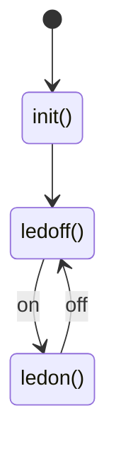

# FsmDiagram

[](https://hex.pm/packages/fsm_diagram)
[](https://hexdocs.pm/fsm_diagram/)

`FsmDiagram` is a State Machine Control library to embed sequences of operations.

## Feature

* This is not to change or control the state, rather to do sequential operations. 
* Sequential steps are implemented by calling state function.
* Transits states mostly by message events to receive inside.


## Usage

it starts according to `fsm_start()` to activate state machine task.

Sample state diagram:


Sample codes:
```
defmodule FsmSample1 do
  @moduledoc """
  Sample of FsmDiagram for test
  """
  use FsmDiagram

  def start_link(fsm_id \\ __MODULE__) do
    {:ok, _pid} = fsm_start(fsm_id, :init, self())
  end

  def init(pid) do
    # initialize process
    send(pid, {:initialized, self(), "finishied init()"})
    moveto(:ledoff, [])
  end

  def ledoff(argv) do
    # turn off led
    _ledoff(argv)
  end
  defp _ledoff(argv) do
    receive do
      {:on, _from, _msg}  -> moveto(:ledon, [0])
      _ -> _ledoff(argv)
    end
  end

  def ledon(argv) do
    # turn on led
    _ledon(argv)
  end
  defp _ledon(argv) do
    receive do
      {:off, _from, _msg} -> moveto(:ledoff, [0])
      _    -> _ledon(argv)
    end
  end
  
  defp moveto(func, argv) do
    func = Function.capture(__MODULE__, func, 1)
    update_fnc(func, argv)
  end
end
```

Each state function will be called by the task fsm_start() kickoff `Task.start_link()`.
You need to prepare `moveto(func, argv)` which set next state function and the argv into FsmDiagram.
Then FsmDiagram callbacks next state function when current function returns.
`fnc` should be added with `Module`(&Module.fnc/1) to allow the different module.  

## installing

```
def deps do
  [
    {:fsm_diagram, "~> 0.1.0"}
  ]
end
```

